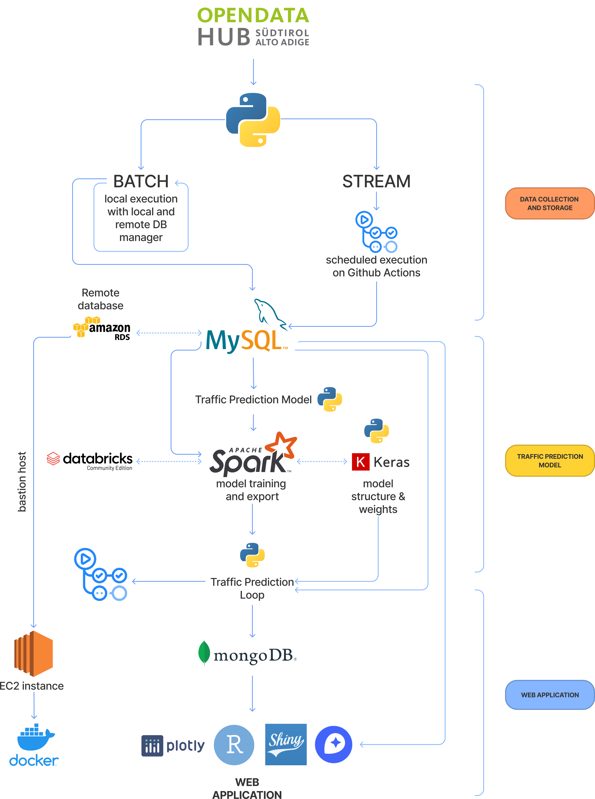

```{r setup, include=FALSE}
# Libraries for data manipulation and visualization
library("shinythemes")
library("flexdashboard")
library("ggplot2")
library("tidyverse")
library("shinyWidgets")
library("shiny")
library("plotly")
library("scales")
library("DT")
library("leaflet")
library("leaflet.extras")
library("maps")
library("rio")

# Connection to DB
source("db_connection.R")
library("RMariaDB")

# Establish connection to MySQL
con <- mysqldbconnect()
mongo_db <- mongodbconnect()

# Inserting token of mapbox for styling
mapboxToken <- config::get(file = "config.yml")$mapbox
Sys.setenv("MAPBOX_TOKEN" = mapboxToken)
```


Real time traffic
=====================================  


```{r}
# Input for selecting a map style
selectInput(inputId = "map_style", 
            label = "Select a style",
            choices = c("streets","open-street-map","light","dark"))
            #width = "100%")

now = format(Sys.time(), "%Y-%m-%d %H:%M:%S",tz = "Europe/Rome")

latest_timestamp = mongo_db$find(
  query = paste0('{"timestamp":{"$gt": "',now,'"}}'),
  sort = '{"timestamp":1}', 
  limit=1)$timestamp[1]

# In case latest data available is furthest than two hours ago
# and predictions are not available for this time or in the future
if(is.null(latest_timestamp)){
  latest_timestamp = mongo_db$find(sort = '{"timestamp":-1}', 
                                   limit=1)$timestamp[1]
}

# Palettes for real-time map
palettes = list("streets" = pals::kovesi.diverging_rainbow_bgymr_45_85_c67(5),
                 "open-street-map" = pals::kovesi.linear_bmy_10_95_c78(5),
                 "light" = pals::brewer.ylorrd(10),
                 "dark" = pals::plasma(50))

```

<h4>`r latest_timestamp`</h4>

### Traffic prediction

```{r}
renderPlotly({
  
  latest_data = data.frame(mongo_db$aggregate(paste0(
   '[{"$match": {"timestamp": "',latest_timestamp,'"}}, 
    {"$group": {"_id": "$station", "count": {"$max": "$count"}}}]'))) %>%
    rename(station = X_id) %>%
    inner_join(dbGetQuery(con, paste0(
      "SELECT name, latitude, longitude FROM bluetoothstations.station 
       WHERE latitude IS NOT NULL and longitude IS NOT NULL;"
    )),by = c("station"="name"))

    # Plotting
  map_style = input$map_style[1]
  plot_mapbox(latest_data) %>%
  add_markers(
    x = ~longitude, 
    y = ~latitude, 
    size = ~count, 
    color = ~count,
    colors = palettes[map_style][[1]],
    # on hover information
    text = ~paste(station,
                  '</br></br>Vehicles: ', count),
    hoverinfo = "text",
    marker=list(opacity = 1,
                size = seq(200,800))
  )%>%
    layout(
      mapbox = list(
        style = map_style, # setting the style
        zoom = 12.5,         
        center = list(lon = 11.35, lat = 46.485)), # centering on Bolzano
      margin = list(l = 0, r = 0, # No Margin around the plot
                    b = 0, t = 0,
                    pad = 0),
      coloraxis_colorbar_x=-0.15)
})%>%
bindCache(input$map_style)
```

Stations {data-orientation=columns}
=====================================   

```{r}
# List of stations' names
stations = c(dbGetQuery(con, paste0(
      "SELECT name
       FROM bluetoothstations.station"
    )))

# Search bar for the stations
selectInput(inputId = "station", 
            label = "Select a station",
            choices = c("All",stations),
            width = "50%")
```

Column {data-width=400}
-------------------------------------
    
### Stations

```{r}
# Creating the map that shows the selected station
renderPlotly({
  
  # Show all stations
  if(input$station[1]!="All"){
    df = dbGetQuery(con, paste0(
      "SELECT *
       FROM bluetoothstations.station
       WHERE name ='",input$station[1],"'"
    ))
    
  # Show the selected station
  }else{
    df = dbGetQuery(con, paste0(
      "SELECT *
       FROM bluetoothstations.station;"))
  }

  plot_mapbox(df) %>%
  add_markers(
    x = ~longitude, 
    y = ~latitude,
    text = ~name,
    hoverinfo = "text",
    marker=list(opacity = 1,
                size = 10,
                color= '#98d499'))%>%
    layout(
      mapbox = list(
        style = 'light',
        zoom = 8.5,
        center = list(lon = 11.25, lat = 46.35)),
      margin = list(l = 0, r = 0,
                    b = 0, t = 0,
                    pad = 0))
})%>%
bindCache(input$station)
```
   
Column {data-width=600}
-------------------------------------
   
### Traffic per hour

```{r}
renderPlotly({
  
  # Query: traffic of the specific station
  if(input$station[1]!="All"){
    traffic_s = dbGetQuery(con,paste0("
    SELECT *
    FROM bluetoothstations.station_traffic_per_hour
    WHERE station = '",input$station[1],"';"))

  # Query: traffic of the overall stations
  }else{
    traffic_s = dbGetQuery(con,paste0("SELECT hour, AVG(mean) as mean
                                      FROM bluetoothstations.station_traffic_per_hour
                                      GROUP BY hour;"))
  }
  
  # Plotting data inside queries
  plot_ly(traffic_s,
          x = ~hour,
          y = ~mean, 
          type = 'bar',
          text = ~paste(hour,
                  '</br></br>Average no. of vehicles: ', mean),
          hoverinfo = 'text',
          color = ~mean,
          colors = pals::kovesi.isoluminant_cgo_80_c38(24)
          ) %>%
    layout(
      xaxis = list(title = 'Hour'),
      yaxis = list(title = 'Average traffic')
    )
})%>%
  bindCache(input$station)
```

### Traffic over the day

```{r}
renderPlotly({
  if(input$station[1]!="All"){
    traffic_s = dbGetQuery(con,paste0("
    SELECT hour, mean
    FROM bluetoothstations.station_traffic_per_hour
    WHERE station = '",input$station[1],"';"))
    title_p = paste0("Average traffic per hour of station ",input$station[1])
    
  # Plot the traffic of the overall stations
  }else{
    traffic_s = dbGetQuery(con,paste0("
                                      SELECT hour, AVG(mean) as mean
                                      FROM bluetoothstations.station_traffic_per_hour
                                      GROUP BY hour;"))
    title_p = "Average traffic per hour"
  }
  traffic_s <-traffic_s %>%
    mutate(daytime = ifelse(hour>=6 & hour<12,"Morning",
                            ifelse(hour>=12 & hour<18,"Afternoon",
                                   ifelse(hour>=18,"Evening",
                                          "Night"))))
  traffic_s_sum = traffic_s %>%
    select(daytime,mean) %>%
    rename(hour = daytime) %>%
    group_by(hour) %>%
    summarise(mean = mean(mean)) %>%
    mutate(daytime = "")
  rbind(traffic_s,
        traffic_s_sum) %>%
  plot_ly(type='treemap',
          labels = ~hour,
          parents = ~daytime,
          values = ~mean,
          hoverinfo = ~mean) %>%
    layout(
      treemapcolorway=c("#d0f4de","#fcf6bd","#a9def9","#e4c1f9"),
      margin = list(l = 0, r = 0, # No Margin around the plot
                    b = 0, t = 0,
                    pad = 0))
})%>%
bindCache(input$station)
```


History
=====================================    

```{r}
latest_data = dbGetQuery(con,"SELECT DATE(MAX(timestamp))
                         FROM bluetoothstations.measurement;")

# Date range input
dateRangeInput(inputId = "pickup_date", 
  label = 'Date range: ', 
  start = format(latest_data-5,'%Y-%m-%d')[[1]], 
  end = format(latest_data,'%Y-%m-%d')[[1]], 
  min = "2013-01-01",
  max = format(latest_data,'%Y-%m-%d')[[1]],
  startview = "year")

```

Column {data-width=600}
-------------------------------------

### Historical trend of traffic

```{r}
renderPlotly({
  start = input$pickup_date[1]
  end = input$pickup_date[2]
  if(start > end){
   start = end-5
  }
  history = dbGetQuery(con,paste0("
    SELECT timestamp, SUM(count) as vehicles
    FROM bluetoothstations.measurement
    WHERE timestamp BETWEEN '",start,"' AND '",end,"' 
    GROUP BY timestamp;"))
  ggplotly(ggplot(data = history,
                  aes(x=timestamp,
                      y = vehicles,
                      text = paste("Date: ",format(timestamp,"%Y-%m"))))+
             geom_smooth(fill='#BFDCED')+
             labs(title = paste0("Traffic from ",start," to ",end))+
             theme_classic()+
             theme(plot.title = element_text(hjust = 0.5)),tooltip=c('text','vehicles'))
})
```

### Actual historical data
```{r}
renderPlotly({
  start = input$pickup_date[1]
  end = input$pickup_date[2]
  if(start > end){
   start = end-5
  }
  history = dbGetQuery(con,paste0("
    SELECT timestamp, SUM(count) as vehicles
    FROM bluetoothstations.measurement
    WHERE timestamp BETWEEN '",start,"' AND '",end,"' 
    GROUP BY timestamp;"))
  
  plot_ly(history) %>%
    add_trace(
          x = ~timestamp, 
          y = ~vehicles, 
          type = 'scatter', 
          mode = 'lines+markers',
          text = ~paste0("Date: ",format(timestamp,"%Y-%m-%d %H:%M")),
          hoverinfo = 'text',
          line = list(color = '#e4c1f9'),
          marker = list(color = '#daa8f7')
          ) %>%
    layout(title = paste0("Traffic from ",start," to ",end))
})
```

Column {data-width=400}
-------------------------------------

### Dates with most or least traffic

```{r}
renderDataTable({
  history = dbGetQuery(con,paste0("
    SELECT timestamp, SUM(count) as vehicles
    FROM bluetoothstations.measurement
    WHERE timestamp BETWEEN '",input$pickup_date[1],"' AND '",input$pickup_date[2],"' 
    GROUP BY timestamp;")) 
  history$timestamp = format(history$timestamp, "%Y-%m-%d %H:%M")
  datatable(history,
            options = list(pageLength = 20,
               lengthMenu = list(c(10, 20, -1), c('10', '20', 'All')),
               order = list(list(2, 'desc'))))
})
```


Timing trends 
=====================================    

Column {data-width=600}
-------------------------------------

### Traffic for weekdays
```{r}
renderPlotly({
  palette = c("#ffadad","#ffd6a5","#e6f68e","#caffbf","#9bf6ff","#a0c4ff","#ffc6ff")
  data = dbGetQuery(con,paste0("
                               SELECT weekday, hour, AVG(mean) as mean
                               FROM bluetoothstations.time_group
                               GROUP BY weekday, hour;"))
  data$weekday = factor(data$weekday,order=TRUE,levels = c('Sunday','Saturday','Friday','Thursday','Wednesday','Tuesday','Monday'))
  plot_ly(data = data, x = ~hour,colors = palette) %>%
    add_lines(y = ~mean,color = ~weekday)
})
```

### Traffic for months

```{r}
assign_daytime = function(hour){
  ifelse(hour>=6 & hour<12,"Morning",
         ifelse(hour>=12 & hour<18,"Afternoon",
                ifelse(hour>=18,"Evening",
                       "Night")))
}

renderPlotly({
  data = dbGetQuery(con,paste0("SELECT month, hour, AVG(mean) as vehicles
                               FROM bluetoothstations.time_group
                               GROUP BY hour, month
                               ORDER BY hour;"))
    # Mapping months to string
  months = c("January","February","March",
             "April","May","June",
             "July","August","September",
             "October","November","December")
  data$month = months[as.integer(data$month)]
  data$month = factor(data$month, order = TRUE, levels = months)
  data$hour = factor(assign_daytime(data$hour), order = TRUE,levels = c("Night","Evening","Afternoon","Morning"))
  data %>%
    group_by(month,hour) %>%
    summarise(vehicles = mean(vehicles)) %>%
    arrange(month,hour)%>%
  plot_ly(colors = c('#FFADD3','#a9def9','#FBF4B1','#CDF3DC'),
          x = ~month,
          y = ~vehicles,
          color = ~hour,
          type='bar')%>%
    layout(barmode = 'group')
})
```

Column {data-width=400}
-------------------------------------

### Traffic over weekdays and time of the day

```{r}
renderPlotly({
  data = dbGetQuery(con,"SELECT weekday, hour, AVG(sum) as vehicles
                               FROM bluetoothstations.time_group
                               GROUP BY weekday, hour;")
  data_second = data %>%
    group_by(weekday) %>%
    summarise(count = sum(vehicles)) %>%
    rename(hour = weekday) %>%
    mutate(weekday = "")
  data$hour = assign_daytime(data$hour)
  data %>%
    group_by(weekday,hour) %>%
    summarise(count = sum(vehicles)) %>%
    rbind(data_second) %>%
    mutate(ids = paste0(weekday,hour)) %>%
    mutate(weekday = ifelse(weekday=='',"Weekdays",weekday)) %>%
  plot_ly() %>%
    add_trace(
      type = 'sunburst',
      ids = ~ids,
      labels = ~hour,
      parents = ~weekday, 
      values = ~count,
      branchvalues = 'total',
      hoverinfo = "label+value+percent parent"
    ) %>%
    layout(sunburstcolorway = c("#ffadad","#ffd6a5","#FBF4B1","#CDF3DC","#a9def9","#bbadff","#FFADD3"))
})
```


### Traffic over different seasons

```{r}
renderPlotly({
  
  # Query with data about months
  data = dbGetQuery(con,"SELECT month, AVG(sum) as vehicles
                               FROM bluetoothstations.time_group
                               GROUP BY month;")
  # Column with seasons
  data$season = ifelse(data$month %in% c(12,1,2),'Winter',
                       ifelse(data$month %in% c(3,4,5), 'Spring',
                              ifelse(data$month %in% c(6,7,8), 'Summer','Autumn')))
  # Mapping months to string
  months = c("January","February","March",
             "April","May","June",
             "July","August","September",
             "October","November","December")
  data$month = months[as.integer(data$month)]
  data %>%
    group_by(season) %>%
    summarise(vehicles = sum(vehicles))%>%
    rename(month = season) %>%
    mutate(season = "Seasons") %>%
    rbind(data) %>%
  # Plot the sunburst
  plot_ly(labels = ~month,
          parents = ~season, 
          type = 'sunburst',
          values = ~vehicles,
          branchvalues = 'total',
          hoverinfo = "label+value+percent parent"
) %>%
    layout(sunburstcolorway = c('#FFADD3','#a9def9','#FBF4B1','#CDF3DC'))
})
```

About
=====================================

Column {data-width=600}
-------------------------------------
### The project

#### Aim
The aim of this project was to design and implement a big data system able to predict in near-time the traffic associated with specific and crucial points of interest monitored by Bluetooth sensors in the Bolzano area. We considered the data available from <a href="https://opendatahub.readthedocs.io/en/latest/index.html" target="_blank">Open Data Hub Südtirol</a>, in particular those related to Bluetooth Stations. 

#### Github Repository

The Github Repository is available <a href="https://github.com/AuroraArctic/Traffic-Project/" target="_blank">here</a>, where continuous data collection is handled by Github Actions and then ingested inside MySQL and MongoDB. 

#### Plots specification

All the plots are interactive and offer the possibility to zoom, de-zoom, select a subset of data by double clicking, download a png version of the plot and compare labels on hover. 

### Results

#### Weekly traffic
As you can see from the previous pages, the busiest hours are 9 am and 3 pm for all days of the week, although Saturday and Sunday have less traffic than working days. A noticeable decrease of vehicles passing is present on Sunday night, since Monday is the first work day of the week, such that in percentage terms the traffic goes from the usual 10% to 5% at night. 

#### Seasonal traffic
The majority of traffic is concentrated in Spring and Summer, although the average traffic in June and July is reduced by more than half compared to the other months.

#### Historical trend and COVID19 influence
Generally, the trend is increasing year by year, except for a specific time period. As expected, during spring 2020, in correspondence of the lockdown due to Covid19, there was a significant fall in terms of traffic, which instead is not so drastically replicated in 2021. 

#### Most trafficked areas
Related to the geographical zones, notice that data is not uniquely referred to Bolzano, but also to Merano, Laives and Trento. The busiest areas are near the A22 highway, in particular in proximity of North Trento, whereas Merano and North Bolzano typically have lightly less trafficked.   

Column {data-width=400}
-------------------------------------
### Pipeline of our project

```{r, echo=FALSE, fig.align='center', fig.pos='h', fig.cap="Stages of the project, divided into Data collection and storage, Traffic Model and Web Application (visualization of results)."}

```


